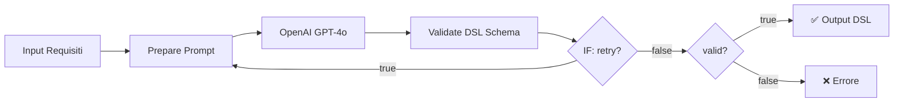

# N8N Workflow Simulator

Simulatore esatto del workflow n8n per test automatizzati della generazione DSL.

## Caratteristiche

✅ **Simulazione fedele**: Replica esattamente l'ambiente n8n con `$json`, `$env`, `$input`
✅ **Codice reale**: Usa i file originali dei Code nodes n8n (no regex, no approssimazioni)
✅ **Loop completo**: Genera → Valida → Retry (se necessario)
✅ **Report dettagliati**: Timeline workflow, DSL intermedie, errori per tentativo

## Prerequisiti

1. **Node.js** (v18+)
2. **OpenAI API Key** configurata

## Setup

```bash
cd dsl-creation-test

# Crea file .env
cat > .env << EOF
OPENAI_API_KEY=sk-your-key-here
MAX_DSL_RETRIES=3
EOF
```

## Utilizzo

### Da file requisiti

```bash
node n8n-workflow-simulator.js ../requisiti-congedo-maternita.md
```

### Da testo diretto

```bash
node n8n-workflow-simulator.js "Bonus Nido per cittadini italiani con ISEE sotto 40000€"
```

## Output

Lo script crea una cartella `tests/{nome-test}/` con:

1. **`workflow-execution-report.md`** - Report completo con:
   - Timeline esecuzione workflow
   - Pipeline nodes eseguiti per tentativo
   - Errori di validazione dettagliati
   - DSL intermedie (collassabili)
   - DSL finale (se valida)

2. **`dsl-generated.json`** - DSL finale (solo se valida)

3. **`execution-data.json`** - Dati raw per debugging

## Esempio Output Console

```
======================================================================
🚀 WORKFLOW N8N SIMULATOR - DSL Generation Pipeline
======================================================================
Requisiti: Bonus Nido per cittadini italiani con ISEE sotto 40000€...
Max tentativi: 3

──────────────────────────────────────────────────────────────────────
📍 TENTATIVO 1/3
──────────────────────────────────────────────────────────────────────

[1] 🔧 Nodo: Prepare Prompt
    ✓ Tentativo: 1/3
    ✓ Modalità: GENERAZIONE

[2] 🤖 Nodo: OpenAI (gpt-4o)
    ⏳ Chiamata in corso...
    ✓ DSL generata (2341 caratteri)

[3] ✅ Nodo: Validate DSL Schema
    ✗ NON VALIDA - 2 errori
      1. Reason 0: variabile "cittadino_italiano" non dichiarata in steps
      2. Step 3: campo "skip_if" contiene sintassi JavaScript invalida

[4] 🔀 Nodo: IF (Check Retry)
    ➜ Retry: TRUE - Loop back to Prepare Prompt

──────────────────────────────────────────────────────────────────────
📍 TENTATIVO 2/3
──────────────────────────────────────────────────────────────────────

[1] 🔧 Nodo: Prepare Prompt
    ✓ Tentativo: 2/3
    ✓ Modalità: CORREZIONE

[2] 🤖 Nodo: OpenAI (gpt-4o)
    ⏳ Chiamata in corso...
    ✓ DSL generata (2398 caratteri)

[3] ✅ Nodo: Validate DSL Schema
    ✓ VALIDA! 🎉

======================================================================
📊 WORKFLOW COMPLETATO
======================================================================
Risultato: ✅ DSL VALIDA
Tentativi: 2/3
Durata: 8.45s
======================================================================

💾 Report salvato: tests/bonus-nido/workflow-execution-report.md
💾 DSL salvata: tests/bonus-nido/dsl-generated.json
💾 Dati esecuzione: tests/bonus-nido/execution-data.json

======================================================================
✨ Test completato: ✅ SUCCESSO
📁 Cartella output: tests/bonus-nido/
======================================================================
```

## Differenze con dsl-creation-test-runner.js

| Feature | dsl-creation-test-runner.js | n8n-workflow-simulator.js |
|---------|----------------------------|---------------------------|
| Simula ambiente n8n | ❌ Parziale | ✅ Completo |
| Usa codice originale nodi | ❌ Regex extraction | ✅ Eval file reali |
| Struttura `$input.first().json.message.content` | ❌ | ✅ |
| Gestisce `tentativo_numero` automatico | ❌ Manuale | ✅ Come n8n |
| Retry flag in validator | ❌ | ✅ |
| Timeline workflow | ❌ | ✅ Con pipeline nodes |

## Configurazione Avanzata

### Max Tentativi

```bash
# Via .env
MAX_DSL_RETRIES=5 node n8n-workflow-simulator.js requisiti.txt

# Via variabile ambiente
export MAX_DSL_RETRIES=2
node n8n-workflow-simulator.js requisiti.txt
```

### Debug

Per vedere i dati raw dell'esecuzione:

```bash
cat tests/{nome-test}/execution-data.json | jq .
```

## Validazione Comportamento

Lo script garantisce la **fedeltà al workflow n8n**:

1. **Nodo "Prepare Prompt"**:
   - ✅ Incrementa automaticamente `tentativo_numero`
   - ✅ Legge `MAX_TENTATIVI` da `$env.MAX_DSL_RETRIES`
   - ✅ Modalità "generazione" vs "correzione" automatica

2. **Nodo "OpenAI"**:
   - ✅ Stessi parametri (model, temperature, seed)
   - ✅ Pass-through dei campi workflow

3. **Nodo "Validate DSL Schema"**:
   - ✅ Input da `$input.first().json.message.content`
   - ✅ Validazioni: schema + sintassi JS + scope variabili
   - ✅ Output con flag `retry: true/false`

4. **IF Node**:
   - ✅ Decisione basata su `validationResult.retry`
   - ✅ Loop con dati corretti (`dsl_da_correggere`, `errori_validazione`)

## Troubleshooting

### `OPENAI_API_KEY not configured`

Crea il file `.env`:

```bash
echo "OPENAI_API_KEY=sk-..." > .env
```

### `Cannot find module 'nodo-code-generazione-prompt.js'`

Verifica di essere nella cartella `dsl-creation-test/`:

```bash
cd dsl-creation-test
node n8n-workflow-simulator.js ...
```

### `SyntaxError in eval()`

Il codice dei nodi contiene errori. Verifica:

```bash
node -c nodo-code-generazione-prompt.js
node -c dsl-schema-validator.js
```

## Workflow n8n Replicato



## License

Stesso del progetto principale.
